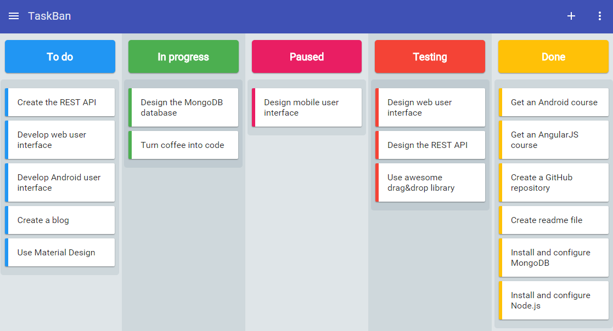

{
  "nbformat": 4,
  "nbformat_minor": 0,
  "metadata": {
    "colab": {
      "provenance": []
    },
    "kernelspec": {
      "name": "python3",
      "display_name": "Python 3"
    },
    "language_info": {
      "name": "python"
    }
  },
  "cells": [
    {
      "cell_type": "code",
      "execution_count": null,
      "metadata": {
        "id": "gx-qpbXzgW4I"
      },
      "outputs": [],
      "source": [
        "## TaskBan\n",
        "***\n",
        "TaskBan is a kanban board web application made with **AngularJS**, **NodeJS**, **ExpressJS** and **MongoDB**, using libraries such as [*Angular Material*](https://material.angularjs.org/latest/) for enhance the user interface and [*Dragula*](http://bevacqua.github.io/angular-dragula/) for the drag and drop.\n",
        "\n",
        "\n",
        "\n",
        "> This is a work in progress\n",
        "\n",
        "### Requirements\n",
        "\n",
        "If you want to test the application, follow the steps below:\n",
        "\n",
        "* Install and configure *NodeJS*, *MongoDB* and *npm*.\n",
        "* Do a ``npm install`` to install the dependencies.\n",
        "* Create a ``config.js`` file like the following:\n",
        "```\n",
        "module.exports = {\n",
        "\tdevelopment: {\n",
        "\t\tdb: 'mongodb://localhost:27017/kanbanDB',\n",
        "\t\tsecret: 'yoursecret',\n",
        "\t\turl: 'http://localhost:8080',\n",
        "\t\tport: process.env.PORT || 8080,\n",
        "\t\temail: 'yourmail@gmail.com',\n",
        "\t\tpassword: 'yourmailpassword'\n",
        "\t}\n",
        "}\n",
        "```\n",
        "* Set the NODE_ENV variable to *development*.\n",
        "* Set the NODE_TLS_REJECT_UNAUTHORIZED variable to 0 to send signup validation email.\n",
        "* Start the web application with ``node server.js``.\n",
        "\n",
        "### License\n",
        "```\n",
        "    Copyright (C) 2016 Juan José Granadilla Manzano\n",
        "\n",
        "    This program is free software: you can redistribute it and/or modify\n",
        "    it under the terms of the GNU General Public License as published by\n",
        "    the Free Software Foundation, either version 3 of the License, or\n",
        "    any later version.\n",
        "\n",
        "    This program is distributed in the hope that it will be useful,\n",
        "    but WITHOUT ANY WARRANTY; without even the implied warranty of\n",
        "    MERCHANTABILITY or FITNESS FOR A PARTICULAR PURPOSE.  See the\n",
        "    GNU General Public License for more details.\n",
        "```"
      ]
    }
  ]
}